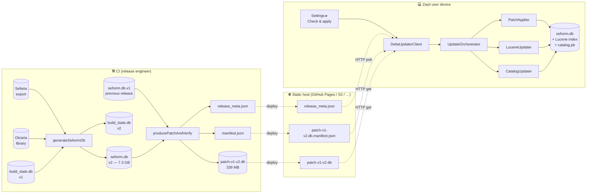
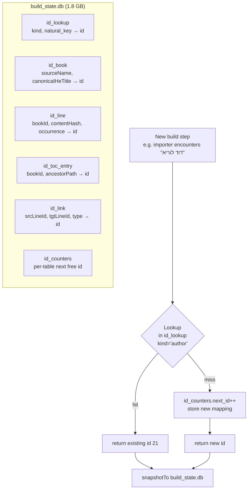
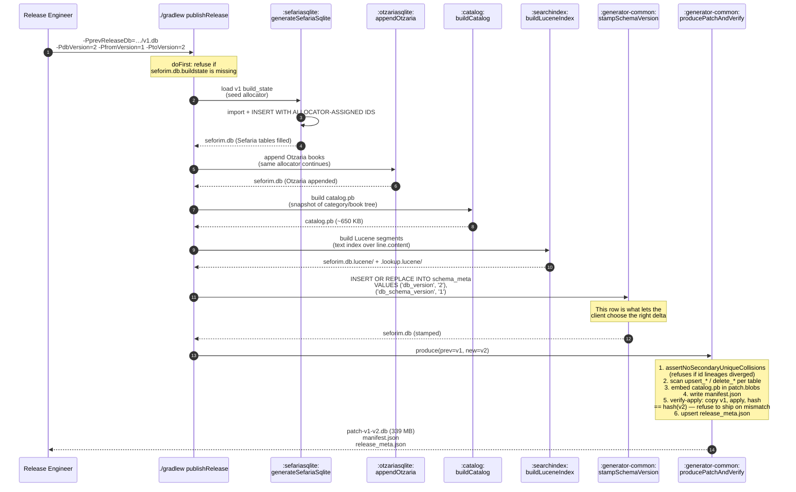
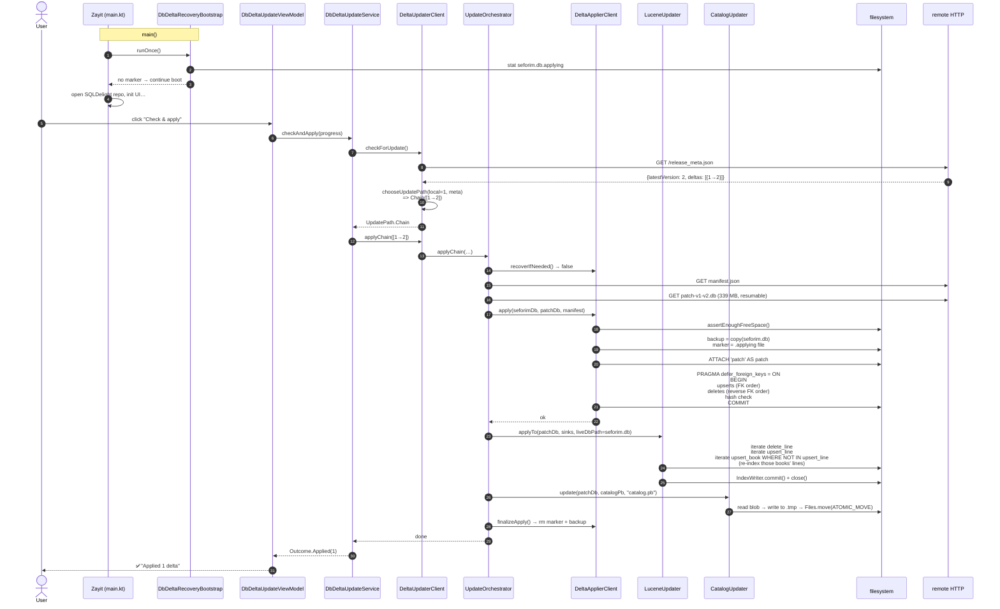
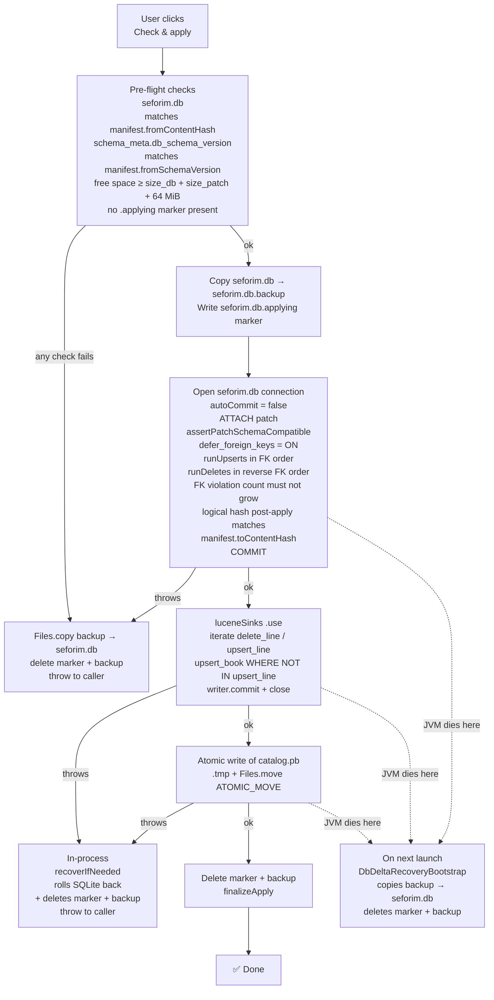
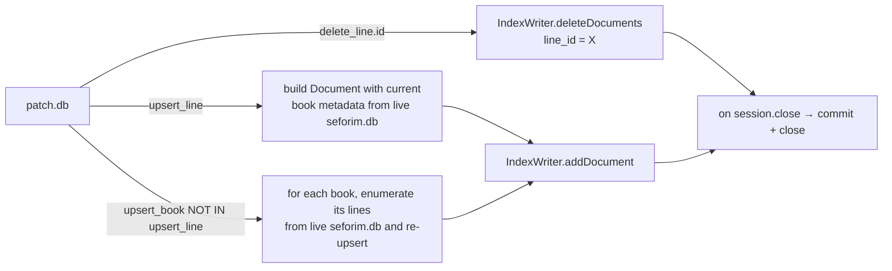

# Delta-update workflow

End-to-end documentation of how a new `seforim.db` release reaches a
running Zayit user via a small incremental patch instead of a 7+ GB
full re-download.

---

## 0. Big picture — one diagram



The contract :

  - `seforim.db` v1 → v2 always produces the SAME `id` for the same
    row (book, line, tocEntry, link, author, topic, …). This is the
    **id-stability invariant** and is what makes a small diff possible.
  - `patch-v1-v2.db` is itself a small SQLite database that the client
    `ATTACH`es and applies. No native code, no custom protocol.
  - **Strict invariant** : `LogicalHash(apply(v1, patch)) == LogicalHash(v2)`.
    The CI verifies this before publishing; ship aborts on mismatch.

---

## 1. Producer side (CI)

### 1.1 The IdAllocator — why ids stay stable



The allocator's natural keys are :

| Table       | Natural key                                     | Notes |
|-------------|-------------------------------------------------|-------|
| `source`    | `name`                                          | "Sefaria", "Otzaria" |
| `author`    | `name`                                          | |
| `topic`     | `name`                                          | |
| `pub_place` | `name`                                          | |
| `pub_date`  | `date` text                                     | |
| `category`  | canonical hebrew path                           | "תנ״ך/תורה/בראשית" |
| `tocText`   | display text                                    | |
| `connection_type` | `name`                                    | "commentary", "targum" |
| `book`      | `(sourceName, canonicalHeTitle)`                | survives renames via book_aliases |
| `line`      | `(bookId, "REF:"+heRef)` for Sefaria, `(bookId, contentHash, occurrenceIdx)` for Otzaria | heRef is THE killer feature — survives Sefaria's prefix renumbering |
| `tocEntry`  | `(bookId, ancestorPath@lineIndex)`              | path is a `/`-joined sequence of tocText ids |
| `link`      | `(srcLineId, tgtLineId, connectionTypeId)`      | |

> If two builds share the same `build_state.db` seed and the corpus
> contents are unchanged, all ids match. If a row's content changes,
> only that row gets a new id; everything around it stays put.

### 1.2 The full producer pipeline



### 1.3 What's inside `patch.db`

```
patch.db
├── patch_meta              schema_version, from_version, to_version, …
├── migrations              optional DDL run before upserts
├── blobs                   catalog.pb (and any future binary asset)
└── for each tracked table T (25 of them):
    ├── upsert_T            same shape as T's columns + PK
    │                       rows in new that are absent or differ in prev
    └── delete_T            T's PK columns only
                            rows in prev that are absent in new
```

Per-table upsert/delete strategy (in `PatchDbProducer.scanUpserts`):

```sql
INSERT INTO upsert_T (...)
SELECT new.<cols>
FROM new.T AS new
LEFT JOIN prev.T AS prev ON <pk match>
WHERE prev.<firstPk> IS NULL
   OR new.col1 IS NOT prev.col1
   OR new.col2 IS NOT prev.col2
   …
```

The `IS NOT` (not `!=`/`<>`) is critical: it treats `NULL` as a
distinct value from `''` and from other values, so toggling a column
between null and empty triggers an upsert.

The verify-apply step at the end is the strongest guarantee:

```
copy(v1) → apply(patch) → LogicalContentHasher.compute() == hash(v2)
```

If this fails, `producePatchAndVerify` exits non-zero and the
release is NOT published.

---

## 2. CDN / static-host layout

```
https://<your-host>/
├── release_meta.json                     ← clients poll this (atomic-written)
├── patch-v1-v2.db                        ← 339 MB binary (sha256 in manifest)
├── patch-v1-v2.db.manifest.json          ← per-delta manifest (atomic-written)
├── patch-v2-v3.db
├── patch-v2-v3.db.manifest.json
└── seforim_bundle.tar.zst                ← full-bundle fallback for older clients
```

`release_meta.json` shape :

```json
{
  "latestVersion": 2,
  "retentionWindow": 30,
  "fullBundle": {
    "version": 2,
    "url": "https://…/seforim_bundle.tar.zst",
    "sha256": "…",
    "size": 8000000000
  },
  "deltas": [
    {"fromVersion": 1, "toVersion": 2, "manifestUrl": "…/patch-v1-v2.db.manifest.json", "totalSize": 354705408}
  ]
}
```

Both this file and per-delta `manifest.json` are written via
`Files.move(ATOMIC_MOVE)` from a sibling `.tmp` so a client polling
mid-write never observes a half-written JSON.

---

## 3. Client side (Zayit)

### 3.1 The big sequence — happy path



### 3.2 The atomic-apply guarantees



Three failure boundaries, all returning the user to a clean
pre-apply state:

1. **Pre-flight** failure → nothing touched, just an error message.
2. **In-process** failure (SQLite/Lucene/catalog throws) → rollback
   in the same process via `recoverIfNeeded` + cleared marker, so
   the next attempt starts from a clean state without needing to
   restart the app.
3. **Hard crash** (kill -9 / power loss) → next launch's
   `DbDeltaRecoveryBootstrap.runOnce()` sees the marker + backup
   pair and restores.

### 3.3 The Lucene side

Important : `patch.db` does **NOT** contain Lucene segment files.
The client re-derives Lucene ops from the SQLite line ops:



Why not ship Lucene segments :

| Strategy ✅ Current             | Strategy ❌ ship segments         |
|----------------------------------|------------------------------------|
| patch.db stays small (339 MB)    | + ~3 GB of Lucene binaries         |
| Robust to Lucene format upgrades | Lock client to producer's version  |
| Client picks its own analyzer    | Analyzer baked into segments       |
| Client pays ~10–30 s CPU on apply | Free                              |

The `upsert_book WHERE NOT IN upsert_line` re-index catches the
case where a book's metadata changed (title, categoryId, orderIndex,
isBaseBook) without any of its line content changing — without this
catch, search results would carry stale book titles.

---

## 4. Data on disk after one apply

```
~/.local/share/zayit/databases/
├── seforim.db                  ← post-apply (now at v2)
├── seforim.db.lucene/          ← updated by LuceneUpdater
├── seforim.db.lookup.lucene/
├── catalog.pb                  ← rewritten atomically from patch.blobs
├── lexical.db                  ← untouched (downloaded once)
├── release_info.txt            ← stale; client uses schema_meta.db_version
└── delta-cache/                ← per-delta dirs; cleaned only on success
    └── delta-v1-v2/            ← left if the apply failed mid-way,
        └── patch_global.db.part   so the next attempt can resume
```

If the apply succeeded, `delta-cache/delta-v1-v2/` is removed by
the orchestrator. If it failed, the partial `.part` survives so
the downloader can resume on the next retry from byte N.

---

## 5. The id-stability check

A long invariant chain holds the whole system together:

```mermaid
flowchart LR
    A[Operator runs<br/>generateSeforimDb]
    B[IdAllocator loads<br/>build_state.db<br/>previous release]
    C[Importer consults<br/>allocator before<br/>EVERY row insert]
    D[seforim.db v2 has<br/>same ids as v1 for<br/>unchanged content]
    E[Producer scans v1 vs v2<br/>tiny upsert / delete diff]
    F[Verify-apply hash<br/>matches v2]
    G[Producer publishes<br/>patch + manifest]
    H[Client local seforim.db<br/>matches manifest<br/>fromContentHash]
    I[Apply produces<br/>byte-identical-to-v2 DB]

    A --> B --> C --> D --> E --> F --> G --> H --> I
```



Any break in this chain is caught early :

  - Step C broken (importer inserts with `INSERT OR IGNORE` instead
    of allocator) → producer's secondary-UNIQUE collision pre-check
    refuses to ship.
  - Step F fails → `producePatchAndVerify` exits non-zero, nothing
    gets uploaded.
  - Step H fails → client refuses the apply with a clear error
    naming the hash mismatch.
  - Step I fails → not possible to detect on the client (no
    independent v2 to compare against), but covered by step F.

---

## 6. Operator runbook (one-liner)

```bash
./gradlew publishRelease \
    -PprevReleaseDb=$HOME/releases/v1/seforim.db \
    -PdbVersion=2 \
    -PfromVersion=1 \
    -PtoVersion=2 \
    -PreleaseMeta=$HOME/releases/release_meta.json \
    -PfullBundleUrl=https://github.com/.../v2/seforim_bundle.tar.zst \
    -PfullBundleSha=<sha256 of the full bundle> \
    -PfullBundleSize=<bytes> \
    -PmanifestBaseUrl=https://github.com/.../v2
```

Before running, copy the previous release's `build_state.db` into
`build/seforim.db.buildstate` (the operator footgun guard in
`publishRelease.doFirst` refuses to start otherwise).

Outputs that you upload to the CDN :

  - `build/seforim.db`                  the freshly-built v2 (full bundle)
  - `build/catalog.pb`                  derived metadata
  - `build/seforim.db.lucene/`          full Lucene index (for full-bundle clients)
  - `build/seforim.db.buildstate`       seed for the v3 release
  - `build/patch-v1-v2.db`              incremental patch (this is the small file)
  - `build/patch-v1-v2.db.manifest.json` per-delta manifest
  - `build/release_meta.json`           updated release index (clients poll this)

---

## 7. Tooling cheatsheet

| Task                                              | Purpose |
|---------------------------------------------------|---------|
| `:generator-common:producePatchAndVerify`         | Produce a patch + run the strict verify-apply |
| `:generator-common:stampSchemaVersion`            | Stamp `schema_meta.db_version` (chained to `generateSeforimDb`) |
| `:generator-common:diagnoseHashMismatch`          | When verify fails, identify which table(s) diverged |
| `:generator-common:compareLogicalContent`         | Hash two whole `seforim.db` files per-table and report differences |
| `:SeforimLibrary:publishRelease`                  | Umbrella: generateSeforimDb + producePatchAndVerify + release_meta |

---

## 8. Validation status (as of 2026-05-13)

  - ✅ Strict invariant `prev + patch == new` verified on real 7+ GB data
  - ✅ Live Zayit GUI applied a 339 MiB patch to a v1 DB in 3m 26s
  - ✅ Post-apply DB matches the directly-built v2 byte-for-byte on
    all 26 hashed tables (`compareLogicalContent: 0 tables diverge`)
  - ✅ Catalog.pb embedded in patch.blobs and written atomically
  - ✅ Lucene index re-derived in lock-step (with the
    `upsert_book WHERE NOT IN upsert_line` fix for metadata-only changes)
  - ✅ `schema_meta.db_version` stamped automatically by `generateSeforimDb`
  - ✅ Recovery boot validated by killing the JVM mid-apply
  - ✅ Marker-based concurrency guard prevents racing applies

The system is ready to merge to master and tag the first delta-enabled
release.
